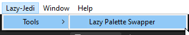
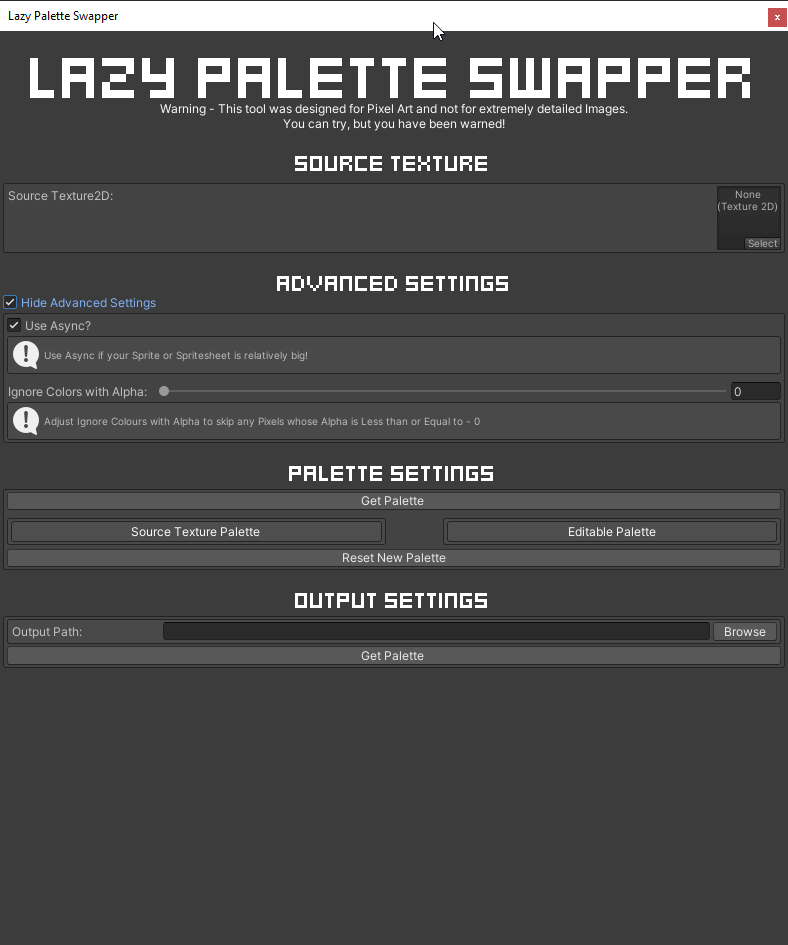
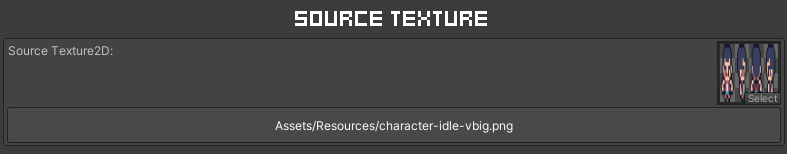
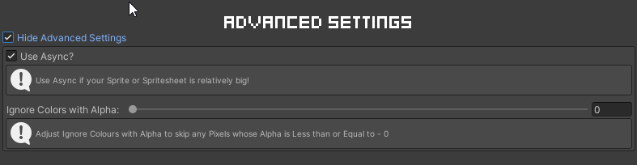
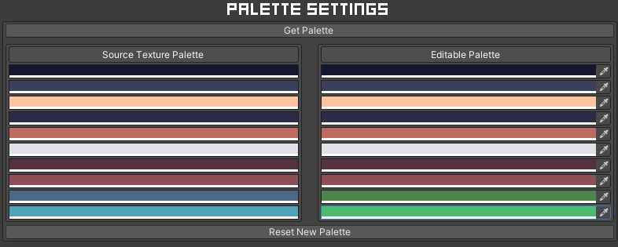
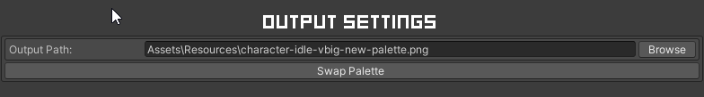

# Unity Lazy Palette Swapper

The Lazy Palette Swapper is tool that allows users to easily swap the Colour Palettes of their Pixel Artwork 
(individual sprites or spritesheets) within the Unity Editor.

In the current project I have included a few demo Spritesheet that you can use to test the tool with. They vary in size so that you
can benchmark the tool on your machine accordingly.

**WARNING** 
This tool was design for Pixel Art, and not for extremely detailed Images. You can try, but you have been warned!

## How to use

### 1. Open The Lazy Palette Swapper

You can find the Tool by navigating the MenuBar - Lazy-Jedi/Tools/Lazy Palette Swapper.

### 2. Use Lazy Palette Swapper

When you open the tool for the first time it will look like the image above. In the following sections I will explain how to use the tool correctly.

#### Source Texture

* Source Texture - The Source Texture is the texture you wish to change with a new Colour Palette.

The original Color Palette will also be extracted from this image and can be used as a guide when mapping your new Colours.

#### Advanced Settings

* Use Async - Processes the "Get Palette" and "Swap Palette" on separate threads to prevent the Unity Editor from hanging.

* Ignore Colours with Alpha - Adjust this value to Ignore any Pixels that has a Less Than or Equal to Alpha Value

#### Palette Settings

* Source Texture Palette - This is a static colour palette of the Source Texture, you can use to to identify colours you wish to change.

* Editable Palette - This is a editable colour palette, any colour on the Left (Source Texture Palette) will be replaced with
  the colour you changed in this editable colours list. Make sure to reference the Source Texture Palette to identify any colours you wish to swap.

#### Output Settings

* Output Path - This will automatically be completed for you, however, if you wish to save the image with a new name or save it
  to a new location you can either edit the output path directly or use the Browse Button to navigate to a directory where you wish to save the newly created
  image.

* Get Palette Button - This button will show if you have not generated the Palette for the Source Image. Once Clicked, it will
  retrieve a unique list of Colours from the Source Texture.

* Swap Palette Button - This button will show if you have a valid Palette that can be used to produce a new image by swapping
  out the original palette for your new palette.

## Future Plans
* Implement a much faster Algorithm to Get and Swap Palettes
* 

## Credits

Vryell - [Tiny Adventure Pack](https://vryell.itch.io/tiny-adventure-pack)
